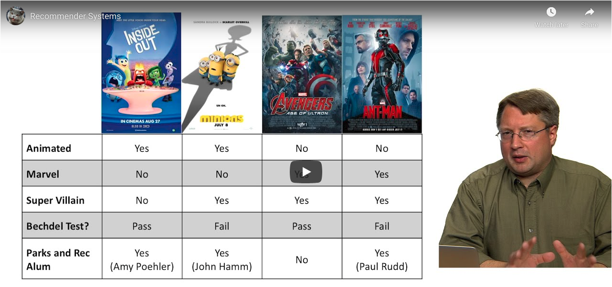

# Streamlit-based Recommender System
### EXPLORE AI Academy Unsupervised Project

 

This repository forms the basis of **Unsupervised Machine Learning Project** in the Data Science course at Explore AI Academy. 

#### What is a Recommender System?

 

The video below gave an overview of Recommender System

In today’s technology driven world, recommender systems are socially and economically critical to ensure that individuals make optimised choices surrounding the content they engage with on a daily basis. One application where this is especially true is movie recommendations; where intelligent algorithms can help viewers find great titles from tens of thousands of options.

#### Objective

The objective of this project was to construct a recommendation algorithm based on content or collaborative filtering, capable of accurately predicting how a user will rate a movie they have not yet viewed, based on their historical preferences.

Providing an accurate and robust solution in this project has immense economic potential, with users of the system being personalised recommendations - generating platform affinity for the streaming services which best facilitates their audience's viewing.

Recommender Systems are a type of information filtering system as they improve the quality of search results and provides items that are more relevant to the search item or are related to the search history of the user.

Almost every major tech company has applied recommender systems in some form: Amazon uses it to suggest products to customers, YouTube uses it to decide which video to play next on autoplay and Facebook uses it to recommend pages to like and people to follow. Furthermore, companies like Netflix and Spotify depend on the effectiveness of their recommendation engines for the success of their business.

